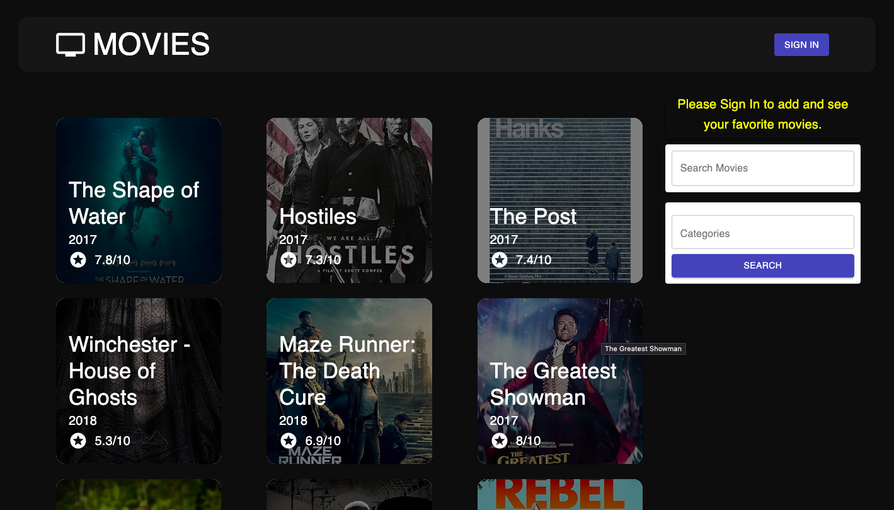

# FilmFo

Visit the website: https://filmfo.vercel.app/movies



## Introduction
Using React, Node.js, Express & MongoDB I have build a Full Stack MERN Application - from start to finish. The App is called "FilmFo" and it is a simple movie database app that allows users to find information about certain movies and add them to their own favorite list.

By the end of this project, I have gained a strong understanding of how the MERN Stack works.

Setup:
- run ```npm i && npm start``` for both client and server side to start the app
